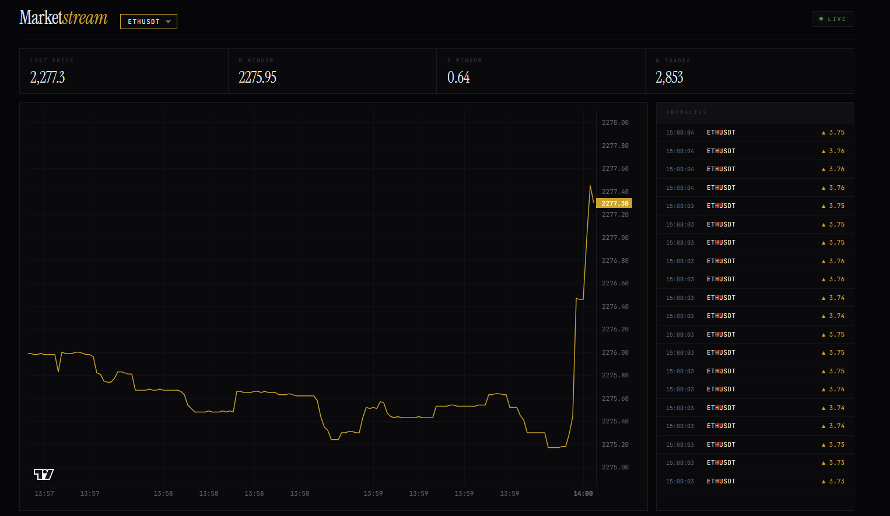

# MarketStream

Real-time crypto market data platform. Binance trades → Kafka → three independent consumers (persistence, rolling features, anomaly detection) → Redis + TimescaleDB → FastAPI + WebSocket dashboard. Built as a study in low-latency concurrency, exactly-once semantics, and load-tested to the point of failure with diagnosed bottlenecks.



## Numbers

| | | |
|---|---|---|
| API P99 latency | **5 ms** | in-network; Docker Desktop bridge adds 50–80ms |
| API throughput | **5–15k req/s** | 4 uvicorn workers, async Redis |
| Sustained Kafka ingest | **~40k msg/s** | producer + broker; degrades gracefully past consumer capacity |
| Anomaly detector | **5,900 msg/s** | up from **33 msg/s** before refactor — **~180× improvement** |
| Persister | **7,500 msg/s** | TimescaleDB via `COPY` + `ON CONFLICT` merge; bottleneck identified |
| Feature processor | **6,500–11,400 msg/s** | 1m / 5m rolling windows per symbol |
| Recovery from kill | **~30 s** | Kafka rebalance latency; no data loss |

## Architecture

```
Binance WS ─▶ Producer ─▶ Kafka (market.trades) ─┬─▶ Persister         ─▶ TimescaleDB
              ▲ lock-free SPSC ring buffer       ├─▶ Feature Processor ─▶ Kafka + Redis
              │ (parse / publish on diff threads)└─▶ Anomaly Detector  ─▶ Kafka (anomalies)
                                                                              │
                                FastAPI ◀─ Redis ◀────────────────────────────┤
                                  │                                           │
                                  ├── HTTP /features /trades                  │
                                  └── WS /stream  ◀───────────────────────────┘
                                          │
                                  React + Vite dashboard
```

Three consumers, three consumer groups, three failure domains. Killing one cannot stall the others — verified in chaos test #1.

## Bottleneck analysis

Methodology: synthetic Kafka producer (4 replicas × ~7–8k/s = ~40k/s aggregate). Throughput measured **inside** each consumer with a wall-clock timer, not from Kafka offsets — offset commit cadence is chunky enough to produce numbers off by ~10× in either direction.

**Anomaly detector — fixed (~180×).** Original `RollingWindow.stats()` did six full deque walks per trade, O(N) where N grew to tens of thousands at active rates. Refactored to maintain running sums (`sum_p`, `sum_p2`, `sum_notional`, `sum_qty`) on add/remove for O(1) stats. 33 → 5,900 msg/s. Still CPU-bound — next ceiling is Python interpreter overhead, addressed by horizontal scale (one detector per partition).

**Persister — diagnosed, mitigation untested.** Settled at ~4,700 msg/s under saturated load. Persister CPU 66%, TimescaleDB 29% — **neither saturated**. Bottleneck is **flush cadence**, not work: each flush is a sync `COPY` + `INSERT…SELECT` + `commit`, during which the consumer thread is blocked from polling Kafka. Average flush ~50ms; tail spikes to 200ms+ under load. `effective_ceiling = batch_size / avg_flush_ms ≈ 1000 / 200ms ≈ 5,000/s` — matches observation. Mitigations (in expected-impact order): (1) pipeline consume + flush via worker thread, (2) larger batch size, (3) horizontal scale per partition.

**Under sustained overload**, all three consumers degrade gracefully: lag grows monotonically, no crashes, no OOMs, no deadlocks. The persister's bottleneck does not block the others — failure isolation by construction.

## Chaos testing

| Test | Result |
|---|---|
| `docker kill persister` under load | Other consumers unaffected. ~30s rebalance, then drained at 7,500 msg/s. ~3M backlog cleared in ~7 min. **No data loss.** Saturated rate (~4.7k) was depressed by load contention; true ceiling without contention is ~7.5k. |
| Network partition to TimescaleDB | Two failure modes depending on persister state. *Mid-flush:* `psycopg` blocked silently for the whole partition (~110s) — no exception until reconnect. *Idle:* container crashed, Docker restarted it. **System survived because of Docker's restart policy, not application-level handling.** Production gaps: `connect_timeout` unbounded, no `statement_timeout` — silent stalls instead of fast failures. |

## Design decisions

- **Kafka over RabbitMQ/NATS** — replayability (reset offset, reprocess), independent consumer groups (failure isolation by default), partitioning by `hash(symbol)` preserves per-symbol ordering for the rolling window.
- **TimescaleDB** — hypertable chunks keep insert latency flat as the table grows; `time_bucket()` + `last(price, time)` makes the chart's seed query a one-liner.
- **Custom SPSC ring buffer in the producer** — isolates parse latency from publish latency. WebSocket reader and Kafka publisher run on separate threads; backpressure on one cannot stall the other.
- **Schema-versioned Redis keys** (`feat:{symbol}:{window}s:{version}`) — old and new schemas coexist briefly during deploys; readers request a specific version.
- **Throughput measured inside the consumer**, not from Kafka offsets — see methodology note above.

## Run

```bash
docker compose up -d --build              # full stack
cd frontend && npm install && npm run dev # dashboard at :5173

# load test
docker compose --profile loadtest up --scale synthetic_producer=4 --build
```

## Known gaps

Anomaly events lack idempotency keys (replay would duplicate). No cross-store atomicity Postgres↔Redis (acceptable: Redis is derived cache). Anomaly detector state is in-memory — warm-up period after restart. Persister mitigation documented, not implemented. No `COPY` vs `INSERT` benchmark yet. `psycopg` connection lacks `connect_timeout` / `statement_timeout` (see chaos #2).

## Stack

Python 3.12 · FastAPI · Kafka (KRaft) · Redis · TimescaleDB · Docker Compose · React + Vite · TradingView lightweight-charts · `psycopg` · `redis.asyncio` · `asyncpg` · `kafka-python` · `orjson`